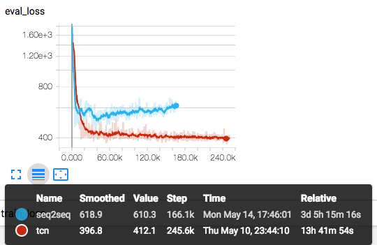
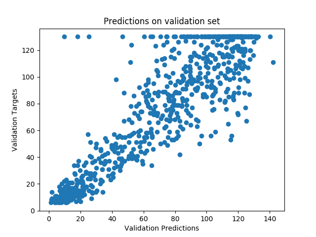

## Predictive maintenance of aircraft engines using deep learning

### Introduction
Predictive maintenance techniques closely monitor the condition of active machinery and predict their remaining-useful-life. This is then used to assess and schedule maintenance to prolong the life of the machinery. Typically, sensors are placed on the machine to monitor acoustics, vibrations or other observations either online (while the equipment is running) or periodically while the equipment is offline. The resulting time-series data can be used in predictive modeling to determine the status of the machine. For details, see [1, 2].

### Data
In order to demonstrate the use of deep learning for predictive maintenance, we used the NASA TurboFan dataset [3, 4]. This dataset consists of time-series data collected using simulations of sensors placed on air-craft engines. Each simulation consists of the engine being operated under different conditions and fault modes until failure . For every time-series sample, the end of the time-series denotes the time-point at which the engine failed. Given any snippet of time-series, the objective of this modeling exercise is to predict the remaining time until the end of the time-series. This is known as the Remaining-Useful-Life, or RUL of the engine.

Data provided consists of two sets - for training and validation. For the training data, the entire time-series until the point of failure was provided. For validation data, snippets of sensor data and their associated RULs were given. Training sensor data was split into snippets of length `seq_len` and the corresponding RULs were calculated. For validation data, all time-series were left-truncated to have the same length.

### Deep Learning Model
We compared two different architectures, one based on Recurrent Neural Networks (RNNs) and another based on Convolutional Neural Networks (CNNs). For the RNN, we implemented a sequence2sequence architecture, similar to the topology used for Neural Machine Translation (NMT) tasks [5]. The sequence2sequence architecture consists of an encoder, which compresses the signal into smaller "embedding" vector, and a decoder, which re-construct the signal from the embedding. When a supervised layer, such as a Multi-Layer Perceptron (MLP) is trained on top of the embedding, the embedding vector tends to capture aspects of the data that are also relevant to predicting the value of interest.

For the CNN architecture, we implemented Temporal Convolution Network [6], which has shown a lot of promise in modeling sequence and temporal data. Its defining features include use of a dilated convolution layer as well as residual or "skip" connections. Increasing the dilation factor at every layer in the CNN increases the receptive field of the neurons deeper in the network, allowing them to capture information from the entire length of the sequence. Causal padding during convolution ensures that information from future time-points does not leak into current prediction of the RUL. Adding skip connections allows modeling of deeper networks.

Mean squared error (MSE) between the predicted and ground-truth RUL was used to train and validate the model.

### Results
Both models were lightly tuned to obtain good performance on the validation set. For a fair comparison, the hyper-parameters of both models was set such that the number of variables between the two models is comparable.

The following plot shows a snapshot of how the validation loss progresses during training, for both the sequence2sequence model and TCN. TCN provides better performance on the test set, with an MSE value of ~412 (~20 time-points), while sequence2sequence is around ~513 (~22 time-points). TCN is also significantly faster, with time-to-train of ~4 minutes per epoch (one pass through training set for training, as plus one pass through validation set to calculate `eval_loss`), while sequence2sequence takes ~30 minutes per epoch. Timing numbers were obtained by training the model on an `Intel(R) Xeon(R) CPU E5-2699A v4` CPU.



The following plot shows estimated RUL values vs. ground-truth for the TCN model:



As expected, predictions get better closer to the time of failure.

### Installation
To run the code, first download the repo locally as follows:
```bash
git clone https://github.com/NervanaSystems/aidc-2018-timeseries.git
```
```bash
cd aidc-2018-timeseries
```
Create and activate a python 3 virtualenv:
```bash
python3 -m venv .venv
. .venv/bin/activate
```
Install the dependencies:
```bash
pip install -r requirements.txt
```
Clone the nGraph repo in a different folder:
```bash
git clone https://github.com/NervanaSystems/ngraph-python.git
```
Intall the nGraph library and add GPU support:
```bash
cd ngraph-python
make install
```


### Training the model
To train TCN, use the command
```bash
python ./turbofan_with_tcn.py --batch_size 128 --dropout 0.1 --ksize 4 --levels 4 --seq_len 50 --log_interval 100 --nhid 70 --lr 0.002 --grad_clip_value 0.4 --results_dir ${RESULTS_DIR} --tensorboard_dir ${TB_DIR} -b cpu --epochs 200 --save_plots
```
To train sequence to sequence model, use the command
```bash
python ./turbofan_autoencoder.py --batch_size 128 --seq_len 75 --log_interval 100 --n_hidden 70,70 --lr 0.002 --grad_clip_value 0.4 --save_plots --results_dir ${RESULTS_DIR} --tensorboard_dir ${TB_DIR} -b cpu --epochs 200 --save_plots
```
where `${RESULTS_DIR}` and `${TB_DIR}` are directory locations to save the results and tensorboard event logs respectively.


[1] [Predictive Maintenance For Enhanced Asset Operation](https://www.intel.com/content/www/us/en/manufacturing/solutions/predictive-maintenance-and-asset-optimization.html)

[2] [Predictive Maintenance Drives Smarter Fleet Management](https://www.intel.com/content/www/us/en/internet-of-things/solution-briefs/predictive-maintenance-fleet-management-brief.html)

[3] [NASA TurboFan dataset](https://ti.arc.nasa.gov/tech/dash/groups/pcoe/prognostic-data-repository/#turbofan)

[4] Ramasso, Emmanuel, and Abhinav Saxena. "Performance Benchmarking and Analysis of Prognostic Methods for CMAPSS Datasets." International Journal of Prognostics and Health Management 5.2 (2014): 1-15.

[5] Sutskever, Ilya, Oriol Vinyals, and Quoc V. Le. "Sequence to sequence learning with neural networks." Advances in neural information processing systems. 2014.

[6] Bai, Shaojie, J. Zico Kolter, and Vladlen Koltun. "An empirical evaluation of generic convolutional and recurrent networks for sequence modeling." arXiv preprint arXiv:1803.01271 (2018).
